# structured_uncertainty_metrics
Source code of the paper "A Graph Is More Than Its Nodes: Towards Structured Uncertainty-Aware Learning on Graphs" [[Paper](http://arxiv.org/abs/2210.15575)]

### Edgewise Uncertainty Metircs

| |Nodewise | Edgewise | Agree | Disagree 
|:-------------------------:|:-------------------------:|:-------------------------:|:-------------------------:|:-------------------------:
GNNs |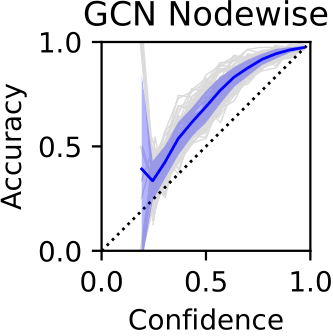<br>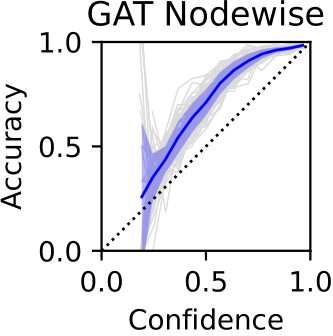  |  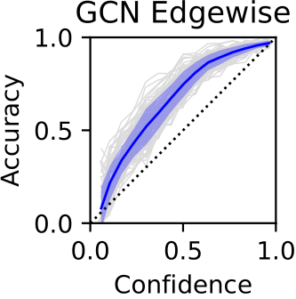<br>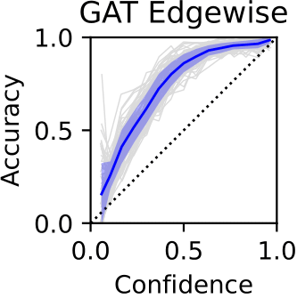 |  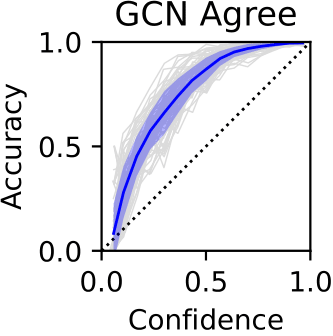<br>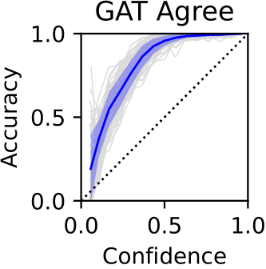 |  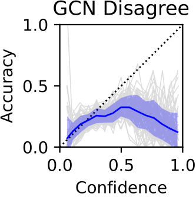<br>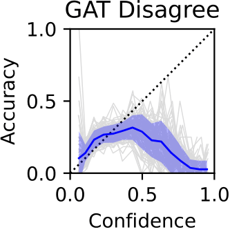
Structured<br>Prediction<br>Models |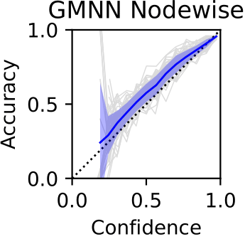<br>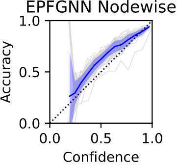 |  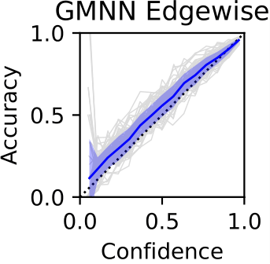<br>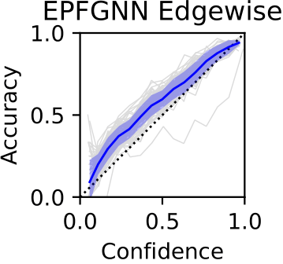 |  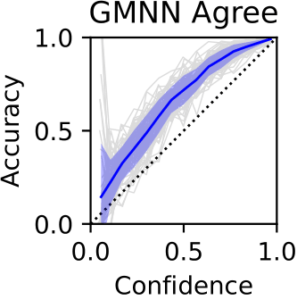<br>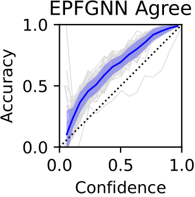 |  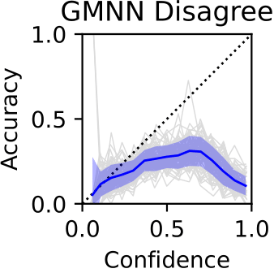<br>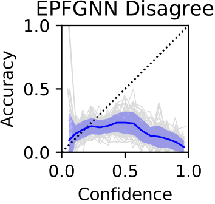

## Requirements

* python >= 3.6
* matplotlib >= 3.2.2
* numpy >= 1.19.5
* pathlib2 2.3.5
* torch 1.7.0+cu101
* torch-geometric 2.0.1

Install the dependencies from requirements file. PyTorch and PyTorch-Geometric are installed with Cuda 10.1.

```
pip install -r requirements.txt
```

## Compare GNNs with strutured prediction models

### Train

* Train GNNs(`GCN` or `GAT`). GNNs model nodewise marginals and do not model the label dependency.

```
PYTHONPATH=. python src/train.py --dataset Cora --model GCN
PYTHONPATH=. python src/train.py --dataset Cora --model GAT
```
* Train structured prediction models(`GMNN` or `EPFGNN`). These models combinine GNNs with markov networks to model the output joint distribution.
```
PYTHONPATH=. python src/train_gmnn.py --dataset Cora --model GMNN
PYTHONPATH=. python src/train_epfgnn.py --dataset Cora --model EPFGNN
```

### Evaluation

* Evaluate the trained model (`GCN`, `GAT`, `GMNN`, or `EPFGNN`) with edgewise uncertainty metrics. Use `--reli_diag` to plot the reliability diagram.

```
PYTHONPATH=. python src/evaluation.py --dataset Cora --model <trained_model> --reli_diag
```

## How to use the edgewise uncertainty metrics

We implemented easy-to-use wrappers for the metrics in `src/metric.py`. For detailed implementation please see `src/calibloss.py`. An example of evaluating your trained models can be like:

```python
from src.metric import NodewiseMetrics, EdgewiseMetrics

log_porb = ... # Make sure your model output is log probability
gt, test_mask = ...  # label and test mask
eval_edge_index = ... # Edges we want to evaluate

node_eval = NodewiseMetrics(log_prob, gt, test_mask)
node_results = node_eval.acc(), node_eval.nll(), node_eval.brier(), node_eval.ece()
edge_eval = EdgewiseMetrics(log_prob, gt, eval_edge_index)
edge_results = edge_eval.acc(), edge_eval.nll(), edge_eval.brier(), edge_eval.ece()
```

### Citation
```
@article{hsuh2022A,
  title={A Graph Is More Than Its Nodes: Towards Structured Uncertainty-Aware Learning on Graphs},
  author={Hans Hao-Hsun Hsu and Yuesong Shen and Daniel Cremers},
  journal={New Frontiers in Graph Learning Workshop, NeurIPS 2022},
  year={2022}
}
```
